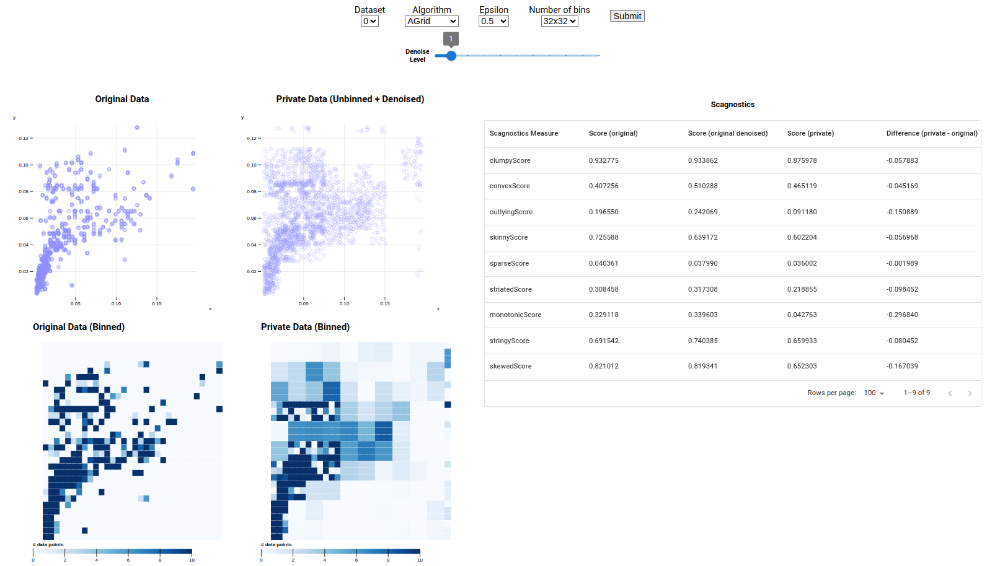

# Measuring utility of differentially private scatterplots through scagnostics
A web application to create differentially private scatterplots and measure their utility through scagnostics. This project is part of the course "Advanced Data Management and Analysis" at Aarhus University. 



## Installation
To install the project, you need to have Node.js installed. You can download it [here](https://nodejs.org/en/download/).

After installing Node.js, you can clone the repository and install the dependencies by running the following commands in the terminal:

```bash
cd backend
pip install -r requirements.txt
cd ../
npm install
npm run dev

```

The last command will run the app in the development mode.\
Open [http://localhost:3000](http://localhost:3000) to view it in the browser.

The page will reload if you make edits.\
You will also see any lint errors in the console.
